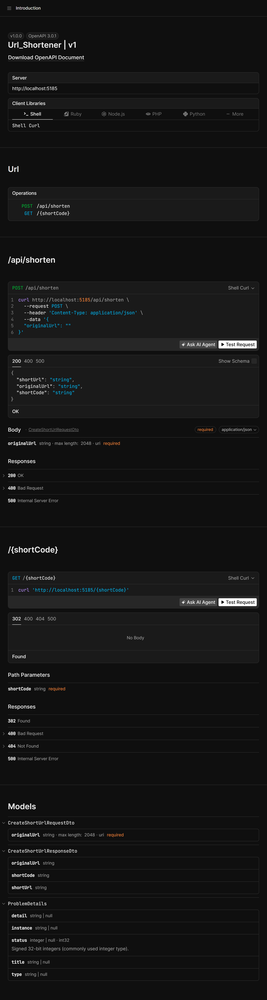
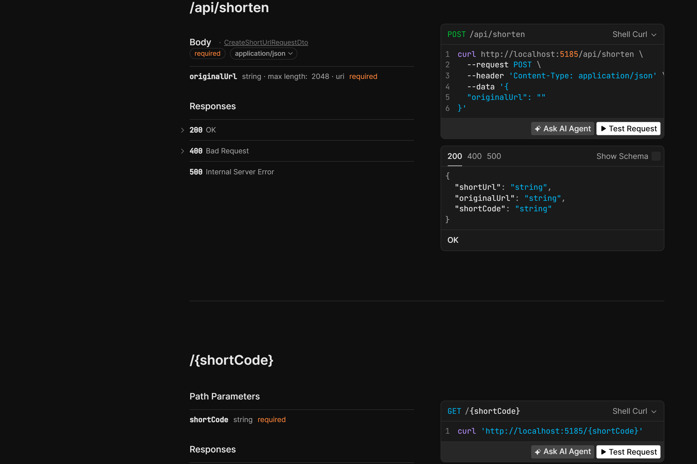

# URL Shortener

A simple, production-ready URL shortener built with ASP.NET Core 9, MySQL 8, and Hashids.net. Generates unique short codes from auto-incremented database IDs using a two-step write pattern.

## Features

- **Short URL Generation** — Convert long URLs into short, shareable links
- **302 Redirects** — Access a short code to be redirected to the original URL
- **Hashids Encoding** — Obscures sequential database IDs using a private salt
- **Two-Step Write Pattern** — Insert row → DB assigns ID → encode ID → update row with short code
- **Clean Architecture** — Controllers → Services → Repositories → Database
- **OpenAPI + Scalar** — Interactive API documentation at `/scalar`

## Tech Stack

| Layer | Technology |
|-------|-----------|
| Framework | ASP.NET Core 9 (Web API) |
| Database | MySQL 8 |
| ORM | Entity Framework Core 9 |
| Encoding | Hashids.net |
| API Docs | Native OpenAPI + Scalar |
| Secrets | .NET User Secrets |

## Architecture

```
┌─────────────┐      ┌──────────────┐      ┌─────────────┐      ┌────────────┐
│  Controller │────▶│   Service     │────▶│  Repository │────▶│   MySQL     │
│  (API/302)  │      │ (Hashids +   │      │  (EF Core)  │      │   (Db)      │
│             │◀────│   Flow Ctrl)  │◀────│             │◀────│             │
└─────────────┘      └──────────────┘      └─────────────┘      └────────────┘
```

### Two-Step Create Flow

```
1. Service calls Repository.AddAsync(originalUrl)
   → INSERT INTO ShortUrls (OriginalUrl, ShortCode) VALUES ('...', NULL)
   → DB assigns auto-increment Id (e.g., 42)

2. Service encodes Id via Hashids
   → Hashids.Encode(42) → "A4yrpg"

3. Service calls Repository.UpdateShortCodeAsync(42, "A4yrpg")
   → UPDATE ShortUrls SET ShortCode = 'A4yrpg' WHERE Id = 42

4. Service assembles full short URL and returns it
```

> **Known Trade-off:** There's a brief window between Step 1 and Step 3 where a row exists with a null `ShortCode`. If the server crashes during this window, the row is orphaned. 

## Screenshots

### Scalar API Documentation


### API Endpoints Detail
POST `/api/shorten` with request body schema and response codes, plus GET `/{shortCode}` redirect endpoint.




## Endpoints

| Method | Path | Description |
|--------|------|-------------|
| `POST` | `/api/shorten` | Create a short URL from a long URL |
| `GET` | `/{shortCode}` | Redirect to the original URL (302) |

### POST /api/shorten

**Request:**
```json
{
  "originalUrl": "https://www.google.com/search?q=url+shortener"
}
```

**Response (200 OK):**
```json
{
  "shortUrl": "http://localhost:5185/A4yrpg",
  "originalUrl": "https://www.google.com/search?q=url+shortener",
  "shortCode": "A4yrpg"
}
```

### GET /{shortCode}

**Response:** `302 Found` with `Location` header pointing to the original URL.

If the short code doesn't exist: `404 Not Found`

## Getting Started

### Prerequisites

- [.NET 9 SDK](https://dotnet.microsoft.com/download/dotnet/9.0)
- [MySQL 8](https://dev.mysql.com/downloads/mysql/)
- Optional: [MySQL Workbench](https://dev.mysql.com/downloads/workbench/) or any MySQL client

### Setup

1. **Clone the repository:**
   ```bash
   git clone https://github.com/Umer-Iftikhar/Url_Shortener.git
   cd Url_Shortener
   ```

2. **Initialize user secrets:**
   ```bash
   dotnet user-secrets init
   ```

3. **Set your secrets** (never commit these):
   ```bash
   dotnet user-secrets set "ConnectionStrings:DefaultConnection" "Server=localhost;Port=3306;Database=UrlShortenerDb;Uid=root;Pwd=YOUR_PASSWORD"
   dotnet user-secrets set "Hashids:Salt" "YOUR_PRIVATE_SALT_HERE"
   ```

4. **Create the database and run migrations:**
   ```bash
   dotnet ef migrations add InitialCreate
   dotnet ef database update
   ```

5. **Run the application:**
   ```bash
   dotnet run
   ```

6. **Open the API documentation:**
   ```
   http://localhost:5185/scalar
   ```

### Testing

**Via PowerShell:**
```powershell
# Create a short URL
Invoke-WebRequest -Uri "http://localhost:5185/api/shorten" -Method POST -Headers @{"Content-Type"="application/json"} -Body '{"originalUrl":"https://www.google.com"}' -UseBasicParsing

# Test redirect (returns 302 + Location header)
Invoke-WebRequest -Uri "http://localhost:5185/YOUR_SHORT_CODE" -Method GET -MaximumRedirection 0 -UseBasicParsing
```

**Via Browser:**
Paste the `shortUrl` from the response directly into your address bar. You should be redirected to the original URL.

## Project Structure

```
Url_Shortener/
├── Controllers/
│   └── UrlController.cs          # API + Redirect endpoints
├── Data/
│   └── AppDbContext.cs             # EF Core DbContext
├── DTOs/
│   ├── Request/
│   │   └── CreateShortUrlRequestDto.cs
│   └── Response/
│       └── CreateShortUrlResponseDto.cs
├── Models/
│   └── ShortUrl.cs                 # Domain entity
├── Repositories/
│   ├── Interfaces/
│   │   └── IShortUrlRepository.cs
│   └── Implementations/
│       └── ShortUrlRepository.cs       # Data access layer
├── Services/
│   ├── Interfaces/
│   │   └── IShortUrlService.cs
│   └── Implementations/
│       └── ShortUrlService.cs         # Business logic + Hashids
├── Program.cs                      # DI, middleware, pipeline
└── appsettings.json                # Non-sensitive config only
```

## Security Notes

- **No credentials in source code** — connection strings and Hashids salt live in user secrets
- **No exception details leaked** — unhandled exceptions are logged internally; clients receive generic error messages
- **Hashids salt is critical** — knowing the salt allows reverse-engineering of all short codes. Protect it like a password

